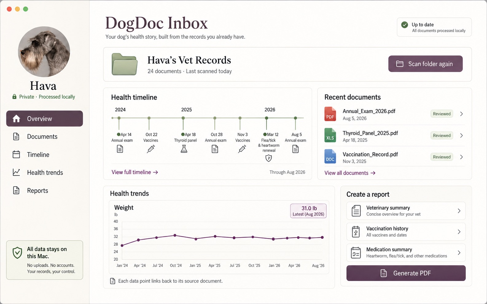
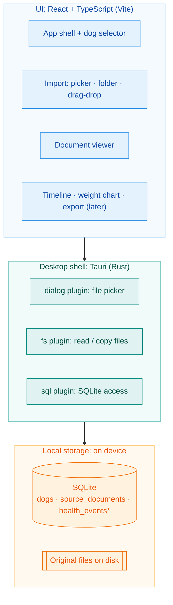

# DogDoc Inbox

**Bring your dog's scattered vet records into one private health dashboard. Find any test, vaccine, or weight in seconds.**

DogDoc Inbox is being developed as an open-source, local-first desktop application for organizing a dog's veterinary records into a searchable, source-linked health history.

The project is being designed for people who have records spread across veterinary portals, PDFs, laboratory reports, certificates, scans, photos, and downloaded files, and want a practical way to understand what they have without moving their entire archive into another cloud service.

> **Project status:** Early development. The first desktop build is planned for macOS, with Windows support to follow.

> **Have an idea, want to contribute, or just want to follow along?**
> Email **Aaron Smith** at **[havatheschnauzer@gmail.com](mailto:havatheschnauzer@gmail.com)** — I'm open to ideas, contributions, and input on the [roadmap](ROADMAP.md).

## What DogDoc Inbox is trying to solve

Veterinary records tend to accumulate in many formats and many places. DogDoc Inbox aims to make those records easier to use while keeping the original documents central to the experience.

At a high level, the application is intended to help users:

- Import or scan folders containing veterinary records.
- Preserve original files rather than replacing them with a generated summary.
- Organize important health events and testing information over time.
- Search across records and extracted information.
- Track genuinely useful longitudinal data, such as weight.
- Review extracted information before treating it as part of the dog's health history.
- Trace important facts back to the original supporting document.
- Create concise, source-linked reports for veterinarians, breeders, co-owners, or puppy owners.

## Looking for contributors

DogDoc Inbox is at the stage where additional developers can have a meaningful influence on the project. If you're interested, get in touch (contact details are at the top) and let me know the area you'd like to work on.

Developers who are also part of the **dog fancy** — dog shows, performance sports, breeding, health testing, or multi-dog record keeping — bring valuable domain perspective. But dog experience is absolutely not required.

See **[CONTRIBUTING.md](CONTRIBUTING.md)** to get started and **[ROADMAP.md](ROADMAP.md)** for where the project is headed.

The stack is a local-first desktop app — **Tauri + Rust**, **React + TypeScript**, **SQLite**, with PDF/OCR document processing. The reasoning behind those choices is in **[docs/adr/](docs/adr/)**.

## Product principles

DogDoc Inbox is being built around a few non-negotiable ideas:

**Local first.** Veterinary records should remain under the owner's control. The desktop application is intended to perform its core work locally rather than requiring a cloud account or silent document upload.

**The original record matters.** Extracted information should supplement the source document, not replace it.

**Source-linked by design.** Important facts should be traceable back to the document, page, or record that supports them.

**Human review matters.** Automated extraction can be useful, but uncertain or important information should be reviewable and correctable by the owner.

**Useful trends, not decorative charts.** A measurement should only become a trend when repeated data actually makes the trend meaningful.

## Architecture

DogDoc Inbox runs as one local-first desktop process: a React and TypeScript interface on a Tauri (Rust) shell, reading and writing on-device SQLite plus your original files. Nothing leaves your machine.

For the full picture, including how a document travels from import to display, see [docs/architecture.md](docs/architecture.md). The reasoning behind each choice lives in the [ADRs](docs/adr/).

## Privacy and test data

Please do **not** commit private veterinary records, personally identifying information, client records, or unredacted medical documents to this repository.

Development fixtures should use synthetic, generated, public-domain, or appropriately redacted records.

## Medical scope

DogDoc Inbox is a record-organization tool. It is not intended to diagnose disease, prescribe treatment, or replace veterinary care.

## License

DogDoc Inbox is licensed under the **Mozilla Public License 2.0 (MPL-2.0)**. See [LICENSE](LICENSE).

MPL-2.0 is an open-source, file-level copyleft license. In practical terms, modifications to MPL-covered source files that are distributed must remain available under the MPL, while the project can still be combined with separately licensed software.

## Roadmap

The first priority is being able to **import a dog and aggregate all of its scattered records into one health history** — the thing that matters most to real owners.

See **[ROADMAP.md](ROADMAP.md)** for the current priorities and what's planned next. Ideas and input are welcome.
