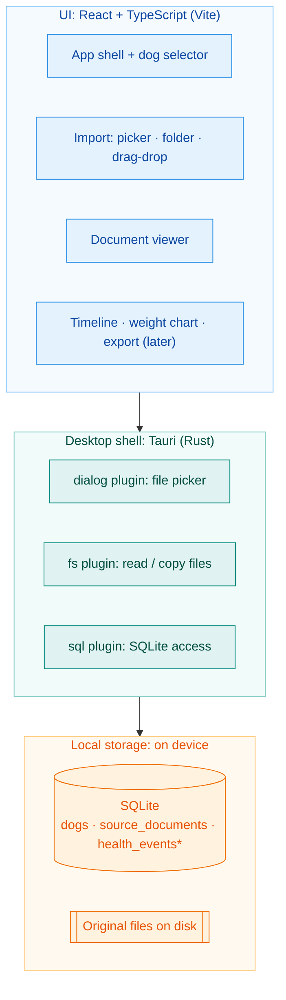
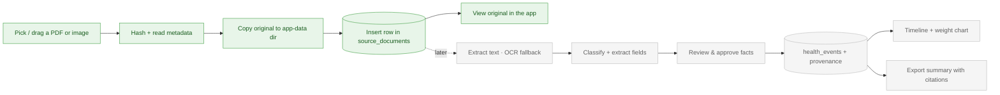

# DogDoc Inbox: Architecture

> **Purpose:** a shared visual of how the pieces fit: the **tool layers** and the **journey of a document** from import to display.
> Complements the architecture **ADRs** ([docs/adr](adr/)), which record *why* each choice was made.

## The layers

The app is a single local-first desktop process: a web UI on top of a native shell, talking to on-device storage. Nothing leaves the machine.

\* `health_events` and related fact tables arrive with the extraction phase.

## The journey of a document

Solid path = the walking skeleton (import → store → view). Dotted path = the extraction phase (extraction, review, history, export).

## Notes

- **Local-first:** the SQLite database and the original files both live on the user's device; there is no server.
- **Pragmatic thin Rust:** SQLite is reached from TypeScript via `@tauri-apps/plugin-sql`; native Rust is kept to plugin registration for now.
- **Provenance:** every extracted fact links back to its source document and page. The dotted path always carries the `source_documents` id forward.

## Related

- [Architecture Decision Records](adr/): the *why* behind these choices.
